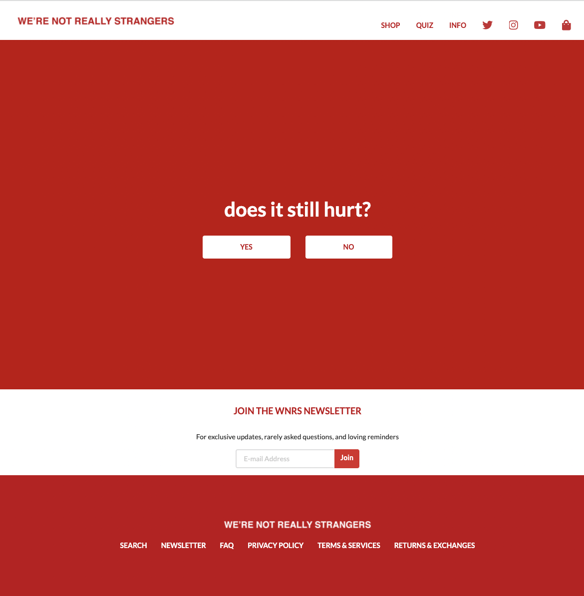
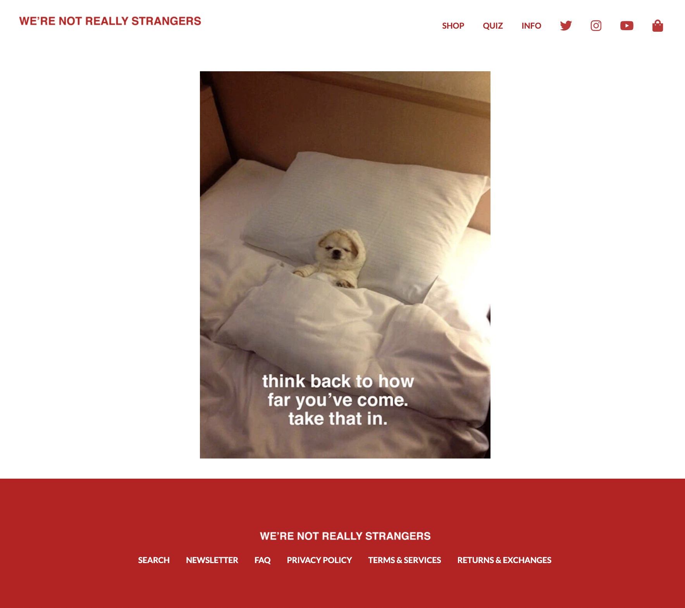

## Semantic UI

Recently, I learned for the first time ever about the basics of user interface design using HTML and CSS. During that time, I struggled a lot with the many new definitions, syntax, and tools that I was not at all familiar with and wondered how long and it would take to build a website that is visually aesthetic. Now, I suddenly came into contact with Semantic UI. Semantic UI is a UI framework that makes it even easier and faster to create those aesthetic that I once thought would take months to complete and design on my own. It has been good to be able to use Semantic UI, but it also feels like there are a million more tools and definitions that I need to learn and adjust to.

Semantic UI has solved a lot of small problems and struggles I faced while using simple HTML calls. However, Semantic UI has been a little bit difficult and is gonna take a lot of practice for me to become accustomed to using. In one of my first projects, I was able to design a webpage of my choice and I found a lot of problems with adjusting the margins because of the set containers. There were also instances where I would edit a class in my CSS file to change a font color, size, or spacing and it wouldn't work, but of course a quick fix to that would be to use "!important". Sadly, it feels like I've been just doing whatever I can to make the website look how I want it to and often times there is no rule or method as to how I am fixing it making it more difficult to have a set system to how I am doing it.

Once familiar with the use of Semantic UI and its many elements, classes, and rules, it will be worth it as it makes creating a website all the more easier. Using raw HTML and CSS may be simple and have fewer items to remember, but it will take a lot more to write using simple HTML to build more complicated websites than it would if the time is taken to understand and remember the various features and tools of Semantic UI.

